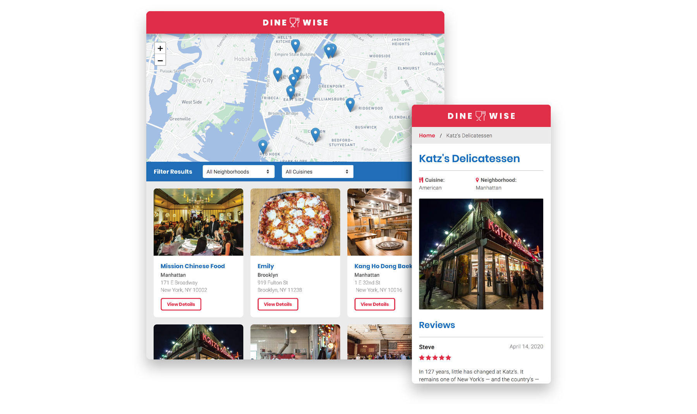

# Project Overview

Dine Wise is a resturant reviews application that allows the user to filter restaurant reviews by location and/or cuisine. It also integrates the Mapbox API to show the restaurant location on an interactive map. Dine Wise uses a Service Worker to cache all of the site’s assets, so that any page that has visited by a user will be accessible offline.

👉Check out the [live version](https://mattrdiamond.github.io/Restaurant-Reviews-App/), or follow the running instructions below to run locally.

## Accessibility Features

1. Ensured that `alt` attributes are present and descriptive for all images.
2. Added screen-reader-only attributes to provide useful supplementary text for assistive technologies.
3. All colors meet WCAG 2.0 level AA requirements, with a contrast ratio of at least 4:5:1 for normal text and 3:1 for large text.

## Running Instructions

1. Test to make sure you have Node and NPM installed by running `node -v` and `npm -v` in terminal.
2. Click on "Clone or Download" on this repository page to download .zip file.
3. Open the root folder of the repository in terminal.
4. Run `npm install` in terminal to install the dependencies.
5. Start a local server to run the app:
   - Run `npm start` in terminal.
   - This will start a local dev server on http://localhost:3000
